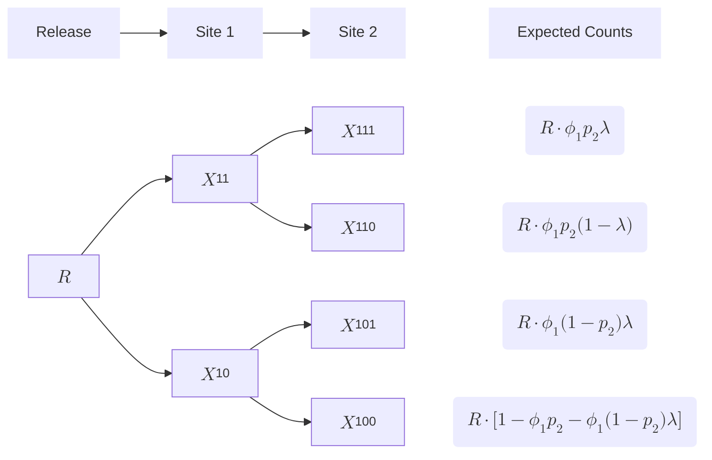

```mermaid
flowchart LR

    a["Release"] --> b["Site 1"]

    b --> c["Site 2"]

    c ~~~ d["Expected Counts"]

    R["$$R$$"] --> x11["$$X$$<sub>11</sub>"] & x10["$$X$$<sub>10</sub>"]

    x11 --> x111["$$X$$<sub>111</sub>"] & x110["$$X$$<sub>110</sub>"]

    x10 --> x101["$$X$$<sub>101</sub>"] & x100["$$X$$<sub>100</sub>"]

    x111 ~~~ Ex111("$$R\cdot\phi_1p_2\lambda$$")

    x110 ~~~ Ex110("$$R\cdot\phi_1p_2(1-\lambda)$$")

    x101 ~~~ Ex101("$$R\cdot\phi_1(1-p_2)\lambda$$")

    x100 ~~~ Ex100("$$R\cdot[1-\phi_1p_2-\phi_1(1-p_2)\lambda]$$")

  

    style a stroke:none

    style b stroke:none

    style c stroke:none

    style d stroke:none

  

    style Ex111 stroke:none

    style Ex110 stroke:none

    style Ex101 stroke:none

    style Ex100 stroke:none
```
