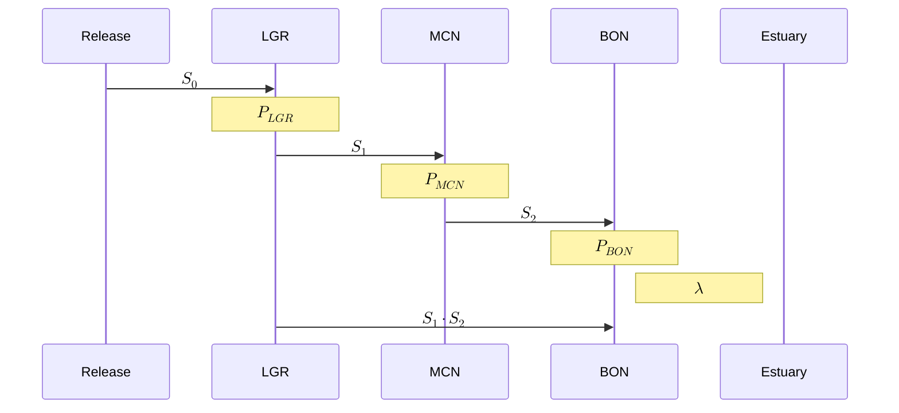
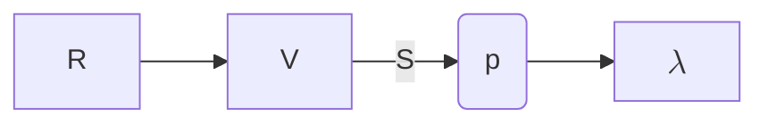
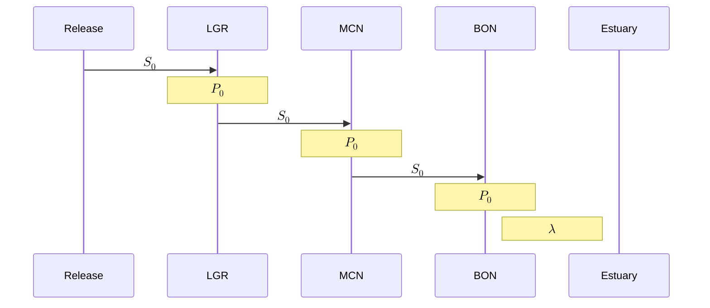
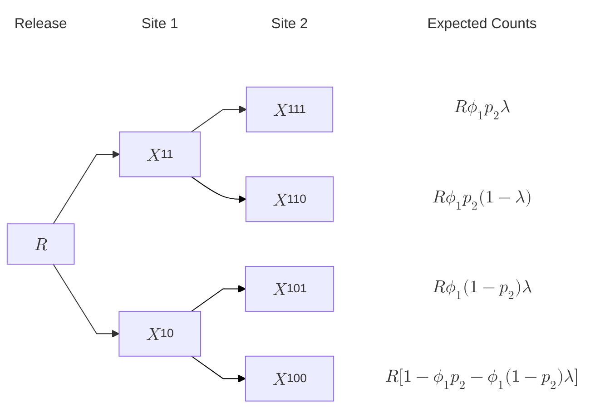

[mermaid live editor](https://mermaid.live/edit#pako:eNpVjc1ugzAQhF_F2lMrkciQHxIfKjWkzSVSe8ipkMMqLBgl2MgYpSnw7jVEVds9rHY038y2cNIpgYDsoq8nicaywzZRzM1zHElT1LbE-sgmk6duR5aVWtGtY5uHnWa11FVVqPzxzm8GiEXtfsCIWVmoc3-3ojH_pqhj23iPldXV8a9zuOqOvcTFu3T1_x1pyKVe4wxFhpMTGhahGRHwIDdFCsKahjwoyZQ4SGgHNwErqaQEhDtTNOcEEtW7TIXqQ-vyJ2Z0k0tw3ZfaqaZK0dK2wNzgL0IqJRPpRlkQfjhWgGjhE8TMX0154M-CMFy7vVx7cAOxCKd8GcxDvuRzzn2-7j34Gn_y6Spc9N9AEHK1)